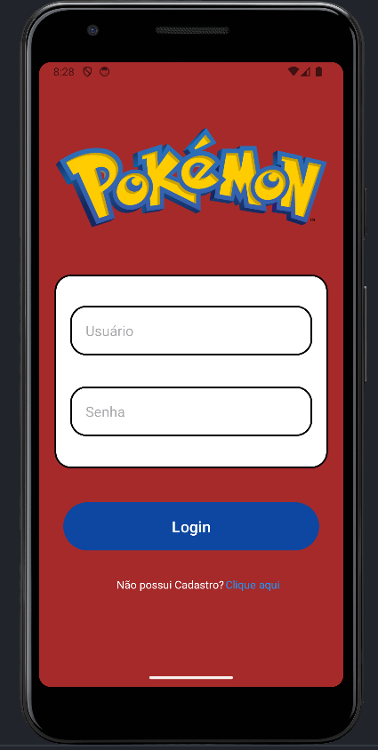

# Projeto1_Desenvolvimento_Mobile

Primeiro projeto somativo da disciplina de Desenvolvimento para Dispositivos Mobile do curso de Sistemas de Informação - PUCPR

## Exigências do projeto

### Faça um app Android que contenha:

* Faça o uso do Recycler View no formato de GRID.
* Consuma os dados de alguma API usando o framework retrofit.
* Persista os dados no SQLite usando o Room
* Tenha uma tela de login e de criação de usuários
* Tenha um item de criatividade
* Tenha pelo menos 4 telas
* Pelo menos um uso de ViewModel
* Tenha um contexto

## Contexto da aplicação

A aplicação desenvolvida consiste na implemendação de uma Pokédex que possibilita ao usuário visualizar uma lista de vários pokemons exibida por meio de requisições na API PokéApi (https://pokeapi.co/). Além disso o Usuário pode acessar cada pokemon individualmente visualizando informações mais detalhadas sobre ele, além de haver a possibilidade de favoritá-lo para que possa acessar sua lista de pokemons favoritados. Os pokemons favoritados são salvos localmente na aplicação então quando um usuário cadastrado estiver logado na aplicação ele poderá acessar a lista de pokemons favoritos.

## Funcionamento da aplicação

A aplicação inicia na tela de login, onde, caso o usuário não possua cadastro, ele pode navegar ate a tela de cadastro e realizá-lo

Com o Login realizado o usuário é direcionado para home da aplicação, onde é possível visualizar os pokemons requisitados pela API

Ao clicar na miniatura de um dos pokemons o usuário é direcionado para uma tela onde é possivel ver informações mais detalhadas sobre o mesmo, além disso o usuário pode navegar entre os pokemons por meio das opções de "NEXT" e "BACK" bem como favoritar o pokemon clicando em "SAVE"

Ao salvar o pokemon a opção de "SAVE" passa ser "DELETE" que ao ser clicada o pokemon é removido da lista de favoritos

Clicando em Home o usuário volta para a tela com todos os pokemons, lá ao clicar em "FAVORITES" a tela é recarregada exibindo os pokemons salvos por aquele usuário, nessa lista também é possível acessar informações detalhadas sobre os pokemons

Ao clicar em "ALL RESULTS" o usuário retorna para a exibição de todos os pokemons retornados pela API e ele pode optar por continuar usando a aplicação ou realizar logout selecionando a opção de "LOGOUT"

